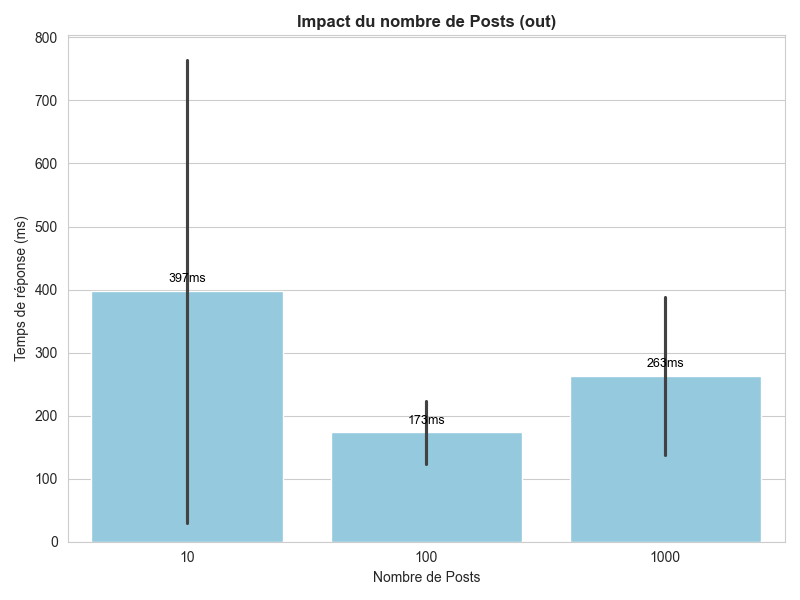
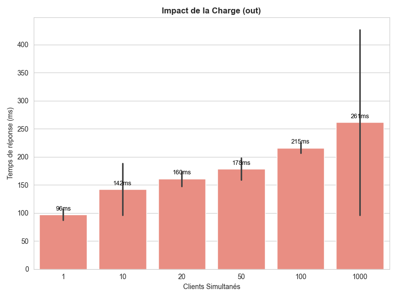

# Benchmark-massiveGCP Thomas Modesto
https://massive-gcp-473713.ew.r.appspot.com/

## Description
Benchmark de l'application Massive GCP : génération de fichiers CSV et visualisation des performances.

## Arborescence importante
- `/old` — CSV produits par les anciens scripts séquentiels (ab).
- `/out` — CSV produits par les scripts multithread actuels.

## Génération des CSV
- `old` : résultats des scripts séquentiel. 
- `out` : résultats des scripts multithread.

## Changements apportés aux scripts
- Remplacement d’Apache Bench (ab) par la bibliothèque Python `requests` avec exécution multithread pour :
    - `bench_conc`
    - `bench_fanout`
    - `bench_post`
- Raison : `ab` produisait fréquemment des erreurs de type "run failed" en cas de forte concurrence.

## Visualisation / Plots
- Les CSV dans `/out` sont ceux générés par les versions les plus récentes des scripts.
- `barplot.py` permet de sélectionner depuis le terminal le dossier à analyser et d’afficher des barplots à partir des CSV pour comparer les performances entre scénarios les plots sont placer dans le dossier `/plots`.
- Conseil : utiliser `/out` pour les plots avec les scripts fonctionnel `/old` pour afficher ce que j'ai obtenu avec la mauvaise méthode.

## Les Plots (contenu dans le dossier `\plotsFinal`)

    
    
    

## Remarques
- Concurrency : On peut remarquer que le temps n'augmente pas linéairement avec le nombre d'utilisateurs, on voit bien qu'il n'y a pas d'explosion de temps de réponse entre 100 et 1000 utilisateurs simultanés. On peut quand meme se demandé si le cache n'influe pas sur les résultats.
- Fanout : Pour les followers on remarque pendant la premiere lancement une grosse différence avec le reste des résultats avec 548.02ms puis GCP a du mettre en cache ou allouer plus de ressources car les autres sont entre 15Oms et 200ms meme si on augmente le nombre de followers.
- Posts : Comme fanout on remarque que le premiere lancement est plus long que les autres cependant on peut voir que ce schéma ce repète a chaque changement de paramètre (10,100,1000). On peut supposer que GCP réalloue des ressources a chaque fois apres un pic de charge.
